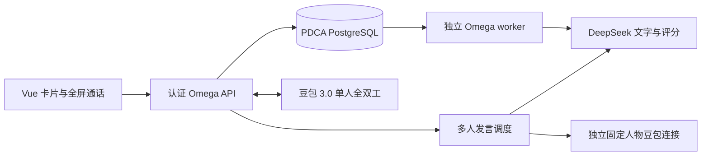

# Omega 积木式陪练：实现与验证

2026-10-09。开发分支 `codex/omega-building-blocks`，基于 main `963f750fa76547492129d00bbdc1d26517d66c6a`。本次完成开发与隔离验证，尚未合并、发布或完成整版业务验收。

## 使用流程

1. 选择新人培训、客户会前演练、真实会议复盘，再选场景卡。用途、会议类型、阶段、背景与人物、目标按五组积木带入，需要时展开修改。
2. 演练点「语音开练」直接进入全屏通话，也可文字开练。真实会议复盘从已有会议中心导入逐字稿，先核对说话人；没有新增会议录音上传能力。
3. 通话中可插话、暂停求助教练、继续同一场景。默认一位对手；模板可配置最多三位人物。
4. 结束自动生成报告，先看做得好、主要卡点、下次怎么说；详细评分与原话按需展开。证据不足显示已获分／可评分分值，不折算完整总分。
5. 报告和逐字稿自动保存。长期记忆先显示变化卡，销售可改字、排除或确认；只有确认的内容进入档案。

## 实现边界



- 单人语音使用豆包全双工 3.0，协议模型 ID `1.2.6.1`。文字场景分析、教练、报告、记忆、多人回答文本使用已配置 DeepSeek；本次真实测试模型为 `deepseek-flash`。DeepSeek 请求显式关闭 thinking，报告与记忆要求 JSON，仍执行严格证据校验，不依赖模型自行遵守格式。
- 多人模式是受控发言：豆包持续识别销售，服务器选人，DeepSeek 生成公开回应，再用该人物的独立豆包连接输出声音。它不是原生端到端多人语音。字幕、音频与落库绑定同一人物、轮次、音频代次。
- 豆包 Key 只在服务端。Codex 不在运行链路内；Web 与 `omega-worker` 使用同一代码版本及数据库。完整启动配置见 `omega-v2-operations.md`。
- 数据迁移为 `019` 模板、`020` 档案、`021` 教练与声音身份；唯一 head 为 `021`。已有库必须运行迁移，不能依赖 `create_all` 添加旧表字段。
- 模板开场、报告任务、档案确认及语音控制均有幂等编号。模板与档案以场次快照冻结；报告 hash 包含人物信息与结束时冻结的教练使用记录。迟到提示不改写既有报告输入。
- 销售、代理、具体事项、本场记录分别保存。来源和目标权限在查询、模型完成、确认时重新检查；同组可读不能代销售确认。模拟对手的订单或付款表态不能变成真实客户事实。
- 档案确认采用版本检查与数据库事务；勾选条目一次提交，各档案版本只增一次。人工修改标记 `seller_note`，推断保留推断类型，出处与更正历史保留。已确认条目更正有 API，本次没有新增确认后编辑的专门前端入口。

主要接口沿用 `/api/omega`：`templates`、`template-starts`、`opportunities`、`profiles`、`reports/{id}/memory-proposal`、`memory-proposals/{id}/apply`，以及场次内的 `coach-hints` 和 `realtime`。实际请求结构以 FastAPI schema 为准。

## 已执行验证

所有业务测试均在隔离库执行，真实模型测试仅使用明确标识的合成话术。没有用客户原文或生产数据库做夹具。

| 检查 | 实际结果 | 范围限制 |
|---|---|---|
| 后端全量 `unittest discover` | 1,054 项，207.288 秒；1,043 项执行通过，11 项跳过 | 跳过的是专用 PostgreSQL 测试，另行执行见下一行 |
| 临时 PostgreSQL 16 | 14 项通过、0 skip，含上述 11 项 PG 与 3 项 SQLite 迁移检查 | 20 并发确认仅应用一次；重复升级及 `021→018→021` 验证；未做备份恢复或失败升级演练 |
| 前端 | Node 测试 23/23，typecheck、build 通过 | 未代表所有实体浏览器兼容 |
| 390×844 浏览器与真实隔离 API | 卡片、修改、文字、自动报告、待确认记忆、确认后档案、两次点击语音启动、暂停恢复、旧代次拒收、错误恢复、麦克风释放通过 | 仅语音 WebSocket 和麦克风输入为模拟；不是实体手机测试 |
| 实际 DeepSeek | 教练、九维报告、记忆提案完整链路通过 | 最近一次报告首个输出被校验拒绝，一次有界重试后通过；不是评分质量验收 |
| 实际豆包 | 原生 ASR、暂停前尾稿保存、同场恢复；三人物实际 PCM 与中断探测通过 | 合成输入、服务端观测，未代表真人听感、手机首音或 P95 |
| 原有浏览器回归 | demo 5.792 秒、browser 8.155 秒，均通过 | 模拟上游与临时 Vite；结束后已清理 |
| 发布文件静态检查 | Compose config、部署 Shell 5/5、部署/SSL PowerShell 3/3、YAML 3/3、diff 检查通过 | 没有本机 Docker daemon，未构建容器；额外扫描发现未修改的 `setup_daily_sync_task.ps1:7` 有4个既有解析错误 |

独立代码复核已完成，复核时未发现剩余已复现 P0/P1；这不替代未执行的业务与实机验收。完整38项签收结果与外部证据见工作文档中的 `06_验收执行表.csv`、`07_实施与自检结果.md` 和 evidence manifest。

## 尾稿保护的限制

暂停与结束累计追踪已发 PCM，等待最终 ASR 后再等待一秒无新 ASR 活动，最长八秒。精确零 PCM 可判定为数字静音；未知非零尾部超时保存失败标记「语音尾稿未完成，请检查逐字稿后重新演练」，保留已保存段落，阻止结束与评分。认证停止接口也不能把不完整尾稿当成成功。

供应商提交确认没有输入 ID／帧偏移，且可能早于最终 ASR，不能作为完整排空证明。超过一秒静默窗口才开始的迟到 ASR 仍存在协议边界，纯环境噪声也可能触发保守失败。已补测迟到转写、提交确认早到、强制停止与报告竞态，但 E14 整项仍未验收。

## 复现入口

在 `pdca-workbench` 中，设置隔离测试数据库、开发环境并禁用外部业务调用后执行：

```text
python -m unittest discover -s tests -p "test_*.py" -q
python scripts/omega_postgres_acceptance.py
python scripts/omega_ui_acceptance.py
```

UI 检查需先在 `apps/web` 执行 `npm run build`。前端标准检查为 `npm test`、`npm run typecheck`、`npm run build`。原有 browser smoke 需临时 Vite 5173；demo smoke 需 `npm run demo` 的5183，两者不得误当真实模型测试。

以下命令需要显式提供未跟踪的凭据文件，只调用对应模型并使用临时库；输出必须放仓库外：

```text
python scripts/omega_text_acceptance.py --env-file PATH --output EXTERNAL_JSON
python scripts/omega_voice_pause_probe.py --env-file PATH --output EXTERNAL_DIRECTORY
python scripts/omega_voice_controlled_probe.py --env-file PATH --output EXTERNAL_DIRECTORY
```

PostgreSQL 脚本要求本机已有 PostgreSQL server binaries，创建、停止并清理自己的临时集群，不读取生产连接串。语音探测脚本不读取实体麦克风。

## 进入发布前仍需完成

1. 连接实体手机：三类模板每场六轮、两次插话、一次30秒暂停，核对声音、人物、尾稿、报告及页面；本次 `adb devices -l` 没有设备。
2. 单人／多人各至少30轮计时，检验验收标准中的 P50／P95；完成20分钟、切网、后台、锁屏、噪声与长度上限测试。
3. 执行18例×3次评分、12段压力测试与人工复盘评审；完成剩余权限入口、提示注入及故障矩阵。
4. 完成备份恢复、失败升级、容器构建与隔离 smoke、精确 main SHA 的 CI、活跃通话保护和发布回滚演练。

上述证据齐全后才能签收整版并发布。当前没有推送、合并或改动线上服务。
